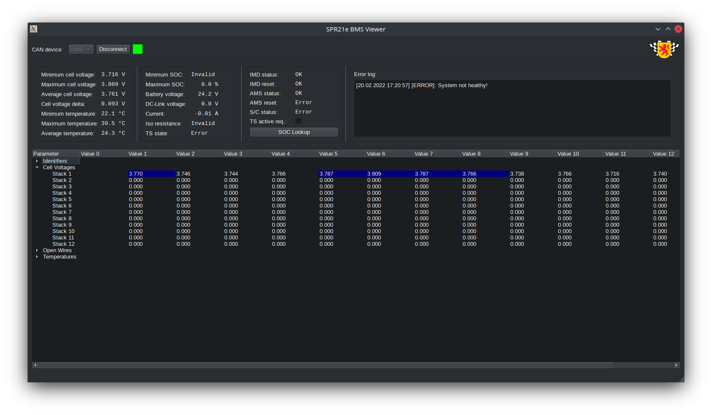

# spr-bms-viewer



## Qt based software to visualize battery data via CAN and configure the BMU.
Related projects:
Hardware: https://github.com/derlucae98/spr23e-bmu
Firmware: https://github.com/derlucae98/spr-bmu-firmware

Display all cell voltages, cell temperatures, wire status, states and errors.
Currently only supports Linux and PEAK PCAN-USB CAN dongles. A port to Windows is planned.

## Installation instructions

This software uses the PCAN as a network device in conjunction with socketcan. It automatically sets the interface up for you. However, since this step requires root privileges, a secondary helper program is used. The main software will promt for the root password on startup and execute the helper as root. The main software therefore does not require root privileges. Although the PCAN driver is included into the Linux kernel, the proprietary driver is used, as it provides some useful features. Note that the installation of this driver has to be repeated after every kernel update.

To get you started:

1. Install Qt-Creator with Qt 5.15.2 libraries
2. Install additional libraries:
```shellscript
sudo apt install libsocketcan2 libsocketcan-dev mesa-common-dev
```
3. Open bms-viewer-helper project
4. In the projects tab, select the build directory of the bms-viewer-helper project, activate shadow build
5. Build the project but do not execute it
6. Open spr21e-bms-viewer project
7. In the projects tab, select the build directory of the spr21e-bms-viewer project, activate shadow build
8. Copy the helper binary from bms-viewer-helper/build into spr21e-bms-viewer/build. Note: This has to be done once, as long as changes are only made in the viewer software.
9. Install proprietary PCAN driver. Download: https://www.peak-system.com/quick/PCAN-Linux-Driver
10. Install it with netdev support:
```shellscript
tar -xzf peak-linux-driver-X.tar.gz
cd peak-linux-driver-X
sudo apt install libpopt-dev
make clean
make PCC=NO PCI=NO ISA=NO DNG=NO NET=NETDEV_SUPPORT
sudo make install
sudo modprobe pcan
cat /proc/pcan
```
11. Run the spr21e-bms-viewer project

After the software has been built, it can be executed directly from the build directory.
